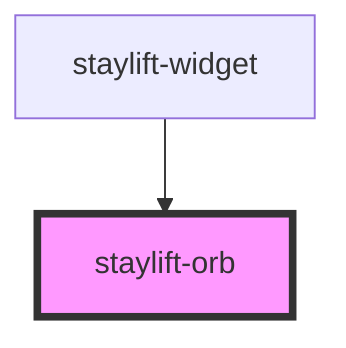

# staylift-orb

<!-- Auto Generated Below -->

## Properties

| Property       | Attribute       | Description | Type                                                    | Default     |
| -------------- | --------------- | ----------- | ------------------------------------------------------- | ----------- |
| `inputVolume`  | `input-volume`  |             | `number`                                                | `0`         |
| `isActive`     | `is-active`     |             | `boolean`                                               | `false`     |
| `outputVolume` | `output-volume` |             | `number`                                                | `0`         |
| `primaryColor` | `primary-color` |             | `string \| undefined`                                   | `'#6366f1'` |
| `size`         | `size`          |             | `"large" \| "medium" \| "small" \| number \| undefined` | `'medium'`  |

## Dependencies

### Used by

 - [staylift-widget](../staylift-widget)

### Graph

----------------------------------------------

*Built with [StencilJS](https://stenciljs.com/)*
