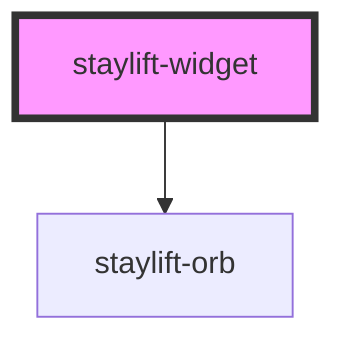

# staylift-widget

<!-- Auto Generated Below -->

## Properties

| Property               | Attribute         | Description | Type                            | Default               |
| ---------------------- | ----------------- | ----------- | ------------------------------- | --------------------- |
| `agentId` _(required)_ | `agent-id`        |             | `string`                        | `undefined`           |
| `autoExpand`           | `auto-expand`     |             | `boolean`                       | `false`               |
| `avatarUrl`            | `avatar-url`      |             | `string \| undefined`           | `undefined`           |
| `brandName`            | `brand-name`      |             | `string`                        | `'Customer Support'`  |
| `fabButtonText`        | `fab-button-text` |             | `string`                        | `'Start'`             |
| `fabPrompt`            | `fab-prompt`      |             | `string`                        | `'Do you need help?'` |
| `language`             | `language`        |             | `string`                        | `'en'`                |
| `mode`                 | `mode`            |             | `"dark" \| "light"`             | `'dark'`              |
| `onlyText`             | `only-text`       |             | `boolean`                       | `false`               |
| `positionX`            | `position-x`      |             | `"center" \| "left" \| "right"` | `'right'`             |
| `positionY`            | `position-y`      |             | `"bottom" \| "top"`             | `'bottom'`            |
| `primaryColor`         | `primary-color`   |             | `string`                        | `'#6366f1'`           |
| `showBranding`         | `show-branding`   |             | `boolean`                       | `true`                |
| `textAgentId`          | `text-agent-id`   |             | `string \| undefined`           | `undefined`           |
| `variant`              | `variant`         |             | `"floating" \| "inline"`        | `'floating'`          |
| `voiceAgentId`         | `voice-agent-id`  |             | `string \| undefined`           | `undefined`           |

## Events

| Event                 | Description | Type                                                                            |
| --------------------- | ----------- | ------------------------------------------------------------------------------- |
| `conversationEnded`   |             | `CustomEvent<void>`                                                             |
| `conversationStarted` |             | `CustomEvent<void>`                                                             |
| `messageReceived`     |             | `CustomEvent<ChatMessage>`                                                      |
| `statusChanged`       |             | `CustomEvent<"connected" \| "connecting" \| "disconnected" \| "disconnecting">` |
| `widgetError`         |             | `CustomEvent<{ message: string; code?: string \| undefined; }>`                 |

## Methods

### `endConversation() => Promise<void>`

#### Returns

Type: `Promise<void>`

### `getStatus() => Promise<WidgetStatus>`

#### Returns

Type: `Promise<WidgetStatus>`

### `sendMessage(text: string) => Promise<void>`

#### Parameters

| Name   | Type     | Description |
| ------ | -------- | ----------- |
| `text` | `string` |             |

#### Returns

Type: `Promise<void>`

### `startConversation(textOnly?: boolean) => Promise<void>`

#### Parameters

| Name       | Type      | Description |
| ---------- | --------- | ----------- |
| `textOnly` | `boolean` |             |

#### Returns

Type: `Promise<void>`

## Dependencies

### Depends on

- [staylift-orb](../staylift-orb)

### Graph

----------------------------------------------

*Built with [StencilJS](https://stenciljs.com/)*
